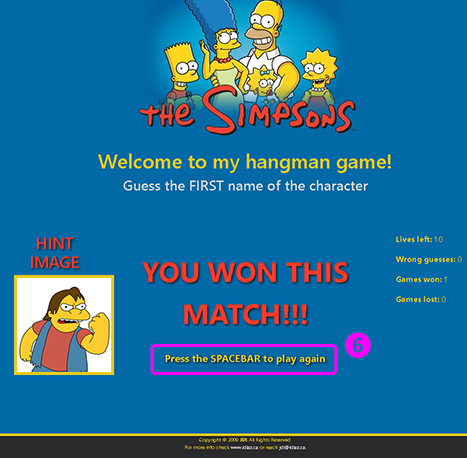

# Word-Guess-Game
> **Cretaed by:**     Juan I Diaz (jdi@idiaz.ca)

> **Date:**           November 2018

## DESCRIPTION
This project is a website version of the game "HANGMAN" where the usere has to guess a word based on certain
clues. The project is meant to test the knowledge of JavaScript and reafirm HTML/CSS structure and developent.

## INSTRUCTIONS
- The objective of the game is to guess the FIRST name of one of the charaters of The Simpsons.
  - You WIN a GAME/MATCH if you correctly guess all the letters of the character (6).
  - You WIN the whole CHALLENGE if you correctly guess all the characters(6). 
- How many characters you ask?... it's a surprise!
- There will be an image of the character to help you (3).
- To START the game hit the `SPACE BAR` key (1).
- Once playing hit the letters keys to guess (2).
- Every key used will be shown (4).
- You start with 10 (TEN) lifes... any grong guess will cost you one life (5).
- Once you lose or win press the `SPACE BAR` to play again (6).

## SCREENSHOTS

## BUILDING TOOLS
- HTML, CSS and Javascript
- Bootstrap v4

## QUESTIONS OR COMMENTS
- Feel free to contact the developer @ <jdi@idiaz.ca>!
- See the project [live](https://juanidiaz.github.io/Word-Guess-Game/).

